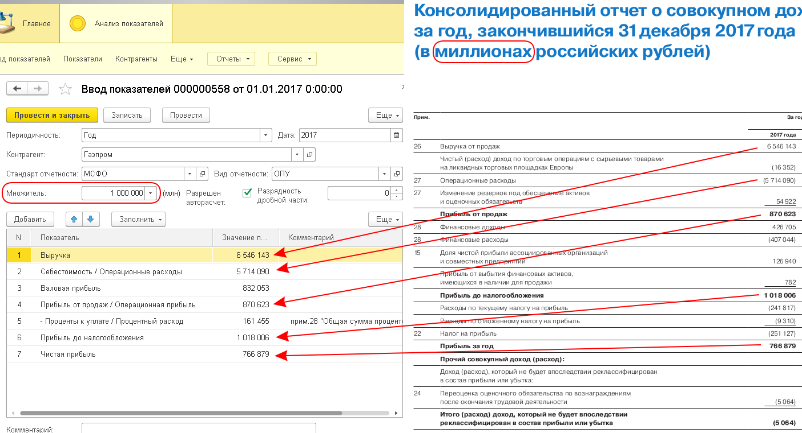

# Ввод данных

Рассмотрим ввод данных на примере ввода отчёта о прибылях и убытках ПАО Газпром по МСФО за 2017 год.

1. Создаём новый документ "*Ввод показателей*", и заполняем шапку:
    * *Периодичность* = "*Год*".
    * *Дата* = "*2017*" (если для выбора даты используется календарь, то выбираем любую дату в пределах 2017 года).
    * *Контрагент* = "*Газпром*".
    * *Стандарт отчетности* = "*МСФО*".
    * *Вид отчетности* = "*ОПУ*" (если бы вводили баланс, то выбрали бы "*Баланс*").
    * *Множитель* = "*1 000 000*" (т.к. все показатели в отчёте указаны "*в миллионах российских рублей*").
    * Если флажок "*Разрешен авторасчет*" установлен, то некоторые значения будут рассчитываться автоматически по мере ввода данных (например, после ввода значения "Выручка" и "Себестоимость / Операционные расходы" автоматически рассчитается "Валовая прибыль"). Автоматически рассчитанные значения при необходимости могут быть исправлены вручную.
    * *Разрядность дробной части* = "*0*" (т.к. в нашем отчёте все показатели целые; если бы показатели в отчёте были указаны с точностью до одного знака после запятой, то мы бы поставили здесь "1" и т.п.).
2. Нажимаем кнопку "*Заполнить*", выбираем пункт меню "*Добавить показатели из группы*" и выбираем группу "*02. ОТЧЕТ О ПРИБЫЛЯХ И УБЫТКАХ*" (если бы вводили баланс, то выбрали бы группу "*01. БАЛАНС*"). При этом табличная часть заполнится показателями, значения которых необходимо ввести.
3. Заполняем значения показателей в табличной части документа данными из отчёта.
4. Проверяем правильность введённых данных.
5. Сохраняем документ.

  